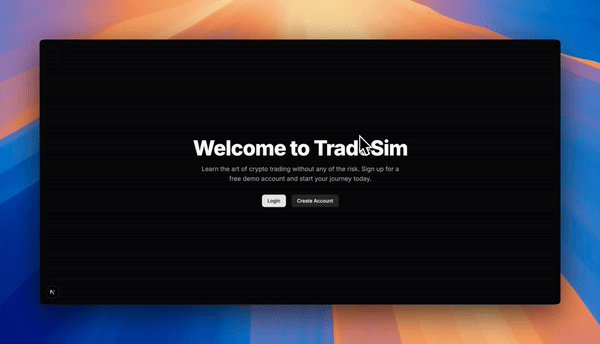

# Crypto Trading Simulator

[](LICENSE)
[]()



A modern, full-stack demo trading platform for learning crypto trading, built with Next.js 15, React 19, TailwindCSS 4, ShadCN/UI, Next-Auth (Auth.js), Prisma, and SQLite (for local/demo). Production deployments can use PostgreSQL.

---

## Table of Contents

- [Features](#features)
- [Tech Stack](#tech-stack)
- [Prerequisites](#prerequisites)
- [Getting Started](#getting-started)
- [Environment Variables](#environment-variables)
- [Project Structure](#project-structure)
- [Deployment](#deployment)
- [Contributing](#contributing)
- [Security](#security)
- [Future Improvements](#future-improvements)
- [License](#license)
- [Contact](#contact)

---

## Features

- Secure registration and login (Next-Auth v5/Auth.js)
- Virtual wallet with $10,000 starting balance
- Real-time Bitcoin price from CoinGecko
- Buy and sell BTC, ETH, and SOL against USDT, with instant P&L updates
- Trade history and profile page
- Modern, responsive UI (TailwindCSS 4 + ShadCN/UI)

## Tech Stack

- Next.js 15 App Router
- React 19
- TailwindCSS 4
- ShadCN/UI
- Next-Auth (Auth.js)
- Prisma ORM
- SQLite (default for local/demo)
- CoinGecko API

## Prerequisites

- **Node.js** v18 or later
- **npm** v9 or later

## Getting Started

### 1. Clone the repository

```bash
git clone https://github.com/ptmfitch/crypto-trading-demo
cd crypto-trading-demo
```

### 2. Install dependencies

```bash
npm install
```

### 3. Set up your database

- By default, the app uses SQLite for local/demo development. No setup required.
- For production, set your `DATABASE_URL` in `.env` to a PostgreSQL connection string.
- Set a strong `AUTH_SECRET` in `.env`.

### 4. Initialize the database

```bash
npx prisma db push
```

### 5. Run the development server

```bash
npm run dev
```

Visit [http://localhost:3000](http://localhost:3000) to use the app.

## Environment Variables

Create a `.env` file in the root directory. Example:

```env
DATABASE_URL="file:./prisma/dev.db" # or your PostgreSQL connection string
AUTH_SECRET="your-strong-secret"
NEXTAUTH_URL="http://localhost:3000"
```

## Project Structure

- `src/app/` — Next.js App Router pages
- `src/actions/` — Server actions for auth and trading
- `src/components/` — UI and layout components (ShadCN/UI)
- `src/lib/` — Prisma client and utilities
- `prisma/` — Prisma schema

## Deployment

- Deploy easily to [Vercel](https://vercel.com/) or [Railway](https://railway.app/).
- For production, set your `DATABASE_URL` to PostgreSQL and ensure all secrets are set in your deployment environment.
- See [Next.js deployment docs](https://nextjs.org/docs/deployment) for more info.

## Contributing

Contributions are welcome! To contribute:

1. Fork the repository
2. Create a new branch (`git checkout -b feature/your-feature`)
3. Commit your changes
4. Push to your fork and submit a Pull Request

## Security

- **Never commit secrets** (like `AUTH_SECRET` or production `DATABASE_URL`) to version control.
- Use environment variables for all sensitive information.

## Future Improvements

- **Production-ready PostgreSQL support** (just update your `.env`)
- **Unit and integration tests** (Vitest, Playwright)
- **User settings/profile editing**
- **Multi-asset support (ETH, etc.)**
- **Leaderboard and social features**
- **Mobile-first UI polish**
- **Accessibility improvements**
- **Better error handling and edge-case UX**
- **Deployment guides for Vercel, Railway, etc.**

## License

MIT

## Contact

For questions or support, open an issue or contact the maintainer.
